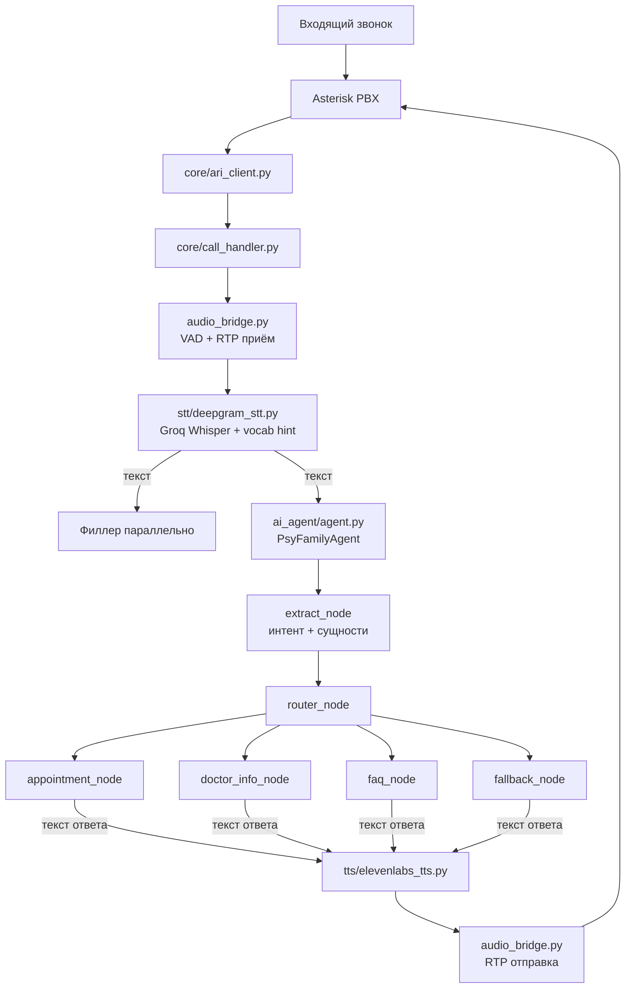
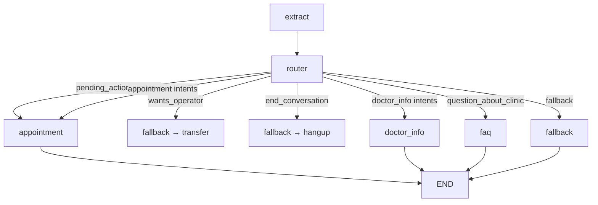
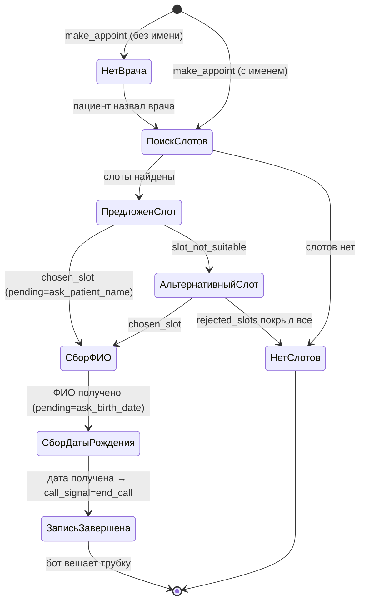

# Архитектура AI Agent

## Общая схема



## Голосовой цикл (call_handler.py)

```
1. Слушаем RTP → VAD (энергия > 50, тишина 0.8с)
2. Аудио → STT (Groq Whisper + vocabulary hint + фильтр галлюцинаций)
3. Параллельно:
   a. Проигрываем филлер из кэша ("Секундочку...", "Сейчас посмотрю...")
   b. Текст → PsyFamilyAgent (asyncio.to_thread)
4. Ответ → TTS (ElevenLabs) → RTP → пациент
5. Проверяем call_signal → если end_call/transfer_operator → бот вешает трубку
6. Если тишина > 30 сек → "Если у вас больше нет вопросов, завершаю звонок. До свидания!" → hangup
```

## Граф LangGraph



**Всегда 3 ноды за вызов:** extract → router → terminal node.

## Маршрутизация (router)

**Приоритет:**
1. `wants_operator` → transfer + hangup (безусловно)
2. `end_conversation` → goodbye + hangup (безусловно)
3. `pending_action` активен (`ask_patient_name`, `ask_birth_date`, `confirm_slot`) → appointment (обязательно)
4. Интент-based routing:
   - `make_appoint`, `asks_about_slot`, `chosen_slot`, `slot_not_suitable` → appointment
   - `prev_intent=chosen_slot` + `arbitrary_message` → appointment (продолжение)
   - `want_procedure`, `question_about_doctor` → doctor_info
   - `question_about_clinic` → faq
   - Всё остальное → fallback

## Стейт-машина записи (appointment_node)



**Ключевое:** pending_action имеет приоритет над intent. Если ждём ФИО — берём текст пациента как ФИО, не ищем врача.

## Управление звонком

| Сигнал | Когда | Что происходит |
|--------|-------|----------------|
| `end_call` | После записи, прощание | Бот произносит фразу → 0.5с → ARI hangup → Asterisk → SIP BYE → Mango |
| `transfer_operator` | "Переключите на оператора" | Бот: "Переключаю..." → hangup |
| Таймаут 30с | Тишина | "Если у вас больше нет вопросов, завершаю звонок. До свидания!" → hangup |

## Паттерн Template + LLM

- **Template** (детерминированный) — слоты, подтверждения, запись (мгновенный ответ)
- **LLM** (генеративный) — FAQ, описание врача, fallback
- **Template + LLM** — "ЭПИ можно пройти у Хайретдинова." + [LLM-описание]

## Филлеры

6 пре-синтезированных фраз кэшируются при первом звонке:
- "Секундочку.", "Сейчас посмотрю.", "Одну секунду."
- "Так, сейчас проверю.", "Минуточку.", "Да, сейчас посмотрю."

Проигрываются параллельно с работой агента (round-robin).
