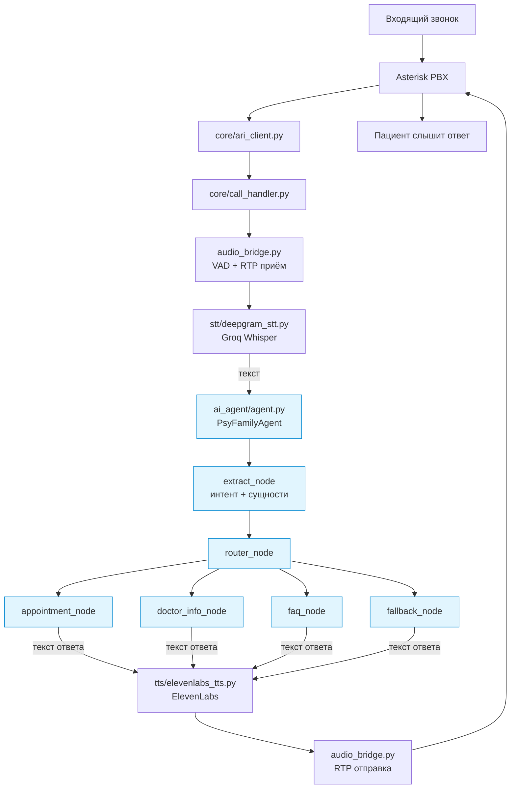

# Связь ai_agent с основным проектом

`ai_agent/` — это мозг бота (диалоговая логика), а основной проект (`core/`, `stt/`, `tts/`) — это голосовой пайплайн (уши и рот). Вместе они образуют единого голосового ассистента.

---

## Архитектура целиком

```
Пациент звонит
    ↓
Mango SIP → Asterisk PBX
    ↓
core/ari_client.py          ← управление звонком (ARI WebSocket + REST)
    ↓
core/call_handler.py        ← жизненный цикл звонка, склейка компонентов
    ↓
┌─────────────────────────────────────────────────────────┐
│  ГОЛОСОВОЙ ЦИКЛ (core/ + stt/ + tts/)                   │
│                                                         │
│  1. Слушаем RTP → audio_bridge.py (UDP, VAD)            │
│  2. Аудио → текст: deepgram_stt.py (Groq Whisper)       │
│  3. Текст → ответ: ██████████████████████████████████   │
│                     ██  ai_agent/agent.py             ██ │
│                     ██  PsyFamilyAgent(text) → text   ██ │
│                     ██████████████████████████████████   │
│  4. Ответ → аудио: elevenlabs_tts.py (ElevenLabs)      │
│  5. Аудио → RTP → audio_bridge.py → Asterisk → пациент  │
│                                                         │
│  Повторять пока звонок не завершен                       │
└─────────────────────────────────────────────────────────┘
```

---

## Зоны ответственности

### Голосовой пайплайн (уже работает)

| Компонент | Файл | Что делает |
|-----------|------|-----------|
| Точка входа | `run.py` | MedBot: ARI подключение, создание CallHandler на каждый звонок |
| ARI клиент | `core/ari_client.py` | WebSocket к Asterisk, REST: answer, bridge, hangup, ExternalMedia |
| Аудио мост | `core/audio_bridge.py` | UDP сокет, приём/отправка RTP пакетов (ulaw 8kHz) |
| RTP | `core/rtp.py` | Парсинг/сборка RTP пакетов (RFC 3550) |
| VAD | `core/call_handler.py:_listen_for_speech()` | Детекция речи по энергии ulaw (порог 50, тишина 0.8с) |
| STT | `stt/deepgram_stt.py` | ulaw → PCM → WAV → Groq Whisper → текст |
| TTS | `tts/elevenlabs_tts.py` | текст → ElevenLabs → MP3 → ulaw |
| Аудио утилиты | `utils/audio.py` | ulaw↔PCM конверсия, ресемплинг |
| Конфигурация | `config/settings.py` | Pydantic Settings, все ключи из `.env` |

### Диалоговая логика — ai_agent (подключается вместо текущего `llm/conversation.py`)

| Компонент | Файл | Что делает |
|-----------|------|-----------|
| Оркестратор | `ai_agent/agent.py` | PsyFamilyAgent: сессии, вызов графа, стриминг |
| Граф | `ai_agent/graph.py` | LangGraph: extract → router → terminal node |
| Извлечение | `ai_agent/nodes/extract.py` | Интент + сущности через structured output |
| Роутер | `ai_agent/nodes/router.py` | Маршрутизация по интенту |
| Запись | `ai_agent/nodes/appointment.py` | Многоходовая стейт-машина записи на прием |
| Врачи | `ai_agent/nodes/doctor_info.py` | Информация о врачах, подбор по процедуре/заболеванию |
| FAQ | `ai_agent/nodes/faq.py` | Ответы о клинике |
| Fallback | `ai_agent/nodes/fallback.py` | Свободная генерация для неклассифицированных запросов |
| Сервисы | `ai_agent/services/*` | LLM, поиск врачей, расписание, FAQ |

---

## Что ai_agent заменяет

AI Agent приходит на замену модулю `llm/`, который сейчас является временной заглушкой:

```
ЗАМЕНЯЕТСЯ (llm/)                   ЗАМЕНЯЕТ (ai_agent/)
──────────────────                   ─────────────────────
llm/conversation.py:Conversation     agent.py:PsyFamilyAgent
  .process_input(text) → str           .__call__(text, session_id) → Generator[AgentChunk]
  .messages[] (плоская история)         LangGraph state + session history
  ._call_llm() + tool calling           extract → router → детерминированные ноды
  ._execute_tool() → medesk stub        appointment_node / doctor_info_node / faq_node

llm/prompts.py:SYSTEM_PROMPT        utils/prompts.py (4 специализированных промпта)
  одна персона "Алиса" на всё            EXTRACTION / FALLBACK / DOCTOR_INFO / FAQ

llm/tools.py:TOOLS_OPENAI           nodes/* (логика вшита в ноды)
  6 tool definitions для LLM            не нужны — роутер + ноды заменяют tool calling

integrations/medesk.py (stub)        services/medesk_service.py + doctors_service.py + faq_service.py
  один mock на всё                       раздельные сервисы с реальными данными
```

### Почему ai_agent лучше для диалоговой логики

| Аспект | `llm/conversation.py` (текущий) | `ai_agent/` (новый) |
|--------|--------------------------------|---------------------|
| Управление потоком | LLM решает через tool calling — непредсказуемо | Детерминированный роутер по интенту |
| Запись на прием | LLM вызывает `book_appointment` — может пропустить шаг | Стейт-машина: слот → ФИО → дата рождения → подтверждение |
| Данные врачей | Один stub mock для всех | `doctors.json` + поиск по имени/процедуре/заболеванию |
| Ответы | Полностью генеративные (LLM может галлюцинировать) | Template для критичных данных + LLM для свободного текста |
| Стриминг | Нет (ждём полный ответ) | Генератор AgentChunk (можно начинать TTS раньше) |

---

## Точка стыка: call_handler.py

`call_handler.py` использует `PsyFamilyAgent` (заменил ранее использовавшийся `Conversation`):

```python
# core/call_handler.py
from ai_agent.agent import PsyFamilyAgent

class CallHandler:
    def __init__(self, ...):
        self.agent = PsyFamilyAgent()
        self._session_id = channel_id   # сессия = звонок
```

Вызов агента из async контекста через `asyncio.to_thread()`:

```python
async def _process_agent_input(self, text: str) -> str:
    def _run():
        chunks = self.agent(text, session_id=self._session_id)
        return "".join(chunk.text for chunk in chunks)
    response = await asyncio.to_thread(_run)
    signal = self.agent.get_call_signal(self._session_id)
    if signal in ("end_call", "transfer_operator"):
        self._ended = True
    return response
```

---

## Что осталось без изменений

Весь голосовой пайплайн остался как есть:

- `run.py` — точка входа, MedBot
- `core/ari_client.py` — Asterisk ARI
- `core/audio_bridge.py` — RTP аудио
- `core/rtp.py` — RTP пакеты
- `core/call_handler.py` — жизненный цикл звонка (меняется только подключение к ai_agent)
- `stt/deepgram_stt.py` — STT (Groq Whisper)
- `tts/elevenlabs_tts.py` — TTS (ElevenLabs)
- `utils/audio.py` — аудио конверсия
- `config/settings.py` — конфигурация

---

## Реализованные изменения

### 1. Async-совместимость

`PsyFamilyAgent` — sync. Вызывается из async `CallHandler` через `asyncio.to_thread()`:

```python
# core/call_handler.py:171-184
async def _process_agent_input(self, text: str) -> str:
    def _run():
        chunks = self.agent(text, session_id=self._session_id)
        return "".join(chunk.text for chunk in chunks)
    response = await asyncio.to_thread(_run)
    signal = self.agent.get_call_signal(self._session_id)
    if signal in ("end_call", "transfer_operator"):
        self._ended = True
    return response
```

### 2. Управление звонком

Добавлены интенты `wants_operator` и `end_conversation` в `PatientIntent`. Router обрабатывает их напрямую, устанавливая `call_signal` в AgentState. `appointment_node` ставит `call_signal = "end_call"` после успешной записи. `CallHandler` проверяет сигнал после каждого вызова агента.

### 3. Конфигурация

- `ai_agent/config.py` — читает из env vars, без хардкода
- `config/settings.py` — добавлены `openai_api_key`, `openai_model`, `openai_proxy_url`
- `.env` / `.env.example` — добавлены секции `OPENAI_*`
- `LLMService` — принимает параметры через конструктор (fallback на env vars)

### 4. Возможные оптимизации

**Стриминг → TTS:** AI Agent стримит ответ по токенам (`AgentChunk`). Можно ускорить:
- Накапливать текст до первого предложения
- Отправить первое предложение в TTS пока генерируется остальное

**Адаптация промптов для голоса:** Промпты написаны для текста. Для голоса стоит:
- Короче ответы (1-2 предложения)
- Разговорный стиль

---

## Итоговая схема после интеграции



Голубым выделен `ai_agent/` — диалоговая логика. Всё остальное — голосовой пайплайн, который не меняется.
