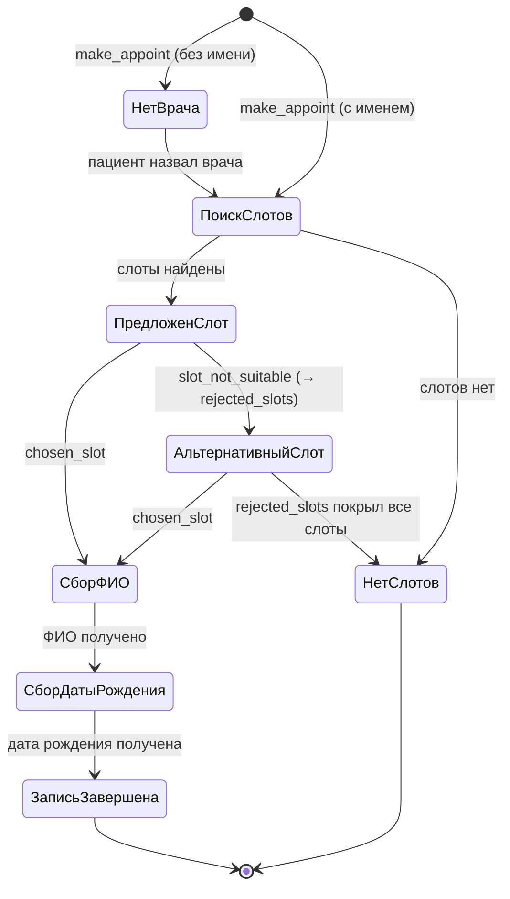

# Сценарии диалога

Примеры пользовательских сценариев с указанием маршрутов и состояний.

---

## 1. Запись к врачу (полный цикл)

```
Пациент: Хочу записаться к Хайретдинову
  -> extract: intent=make_appoint, doctor_name="Хайретдинов"
  -> router: final_route="appointment"
  -> appointment: doctor найден, нет patient_slots
     -> get_available_slots -> ["2026-04-06 10:00", ...]
     -> selected_slot = "2026-04-06 10:00"
     -> pending_action = "confirm_slot"
Ассистент: У Хайретдинова Олега Замильевича свободно в 2026-04-06 10:00, делаем запись?

Пациент: Да, давайте
  -> extract: intent=chosen_slot
  -> router: final_route="appointment"
  -> appointment: intent=chosen_slot, нет patient_name
     -> pending_action = "ask_patient_name"
Ассистент: Подскажите, пожалуйста, ваши ФИО.

Пациент: Иванов Иван Иванович
  -> extract: intent=arbitrary_message, patient_name="Иванов Иван Иванович"
  -> router: prev_intent=chosen_slot + arbitrary_message -> переписывает intent на chosen_slot
  -> appointment: intent=chosen_slot, есть patient_name, нет birth_date
     -> pending_action = "ask_birth_date"
Ассистент: Подскажите, пожалуйста, дату рождения.

Пациент: 15.03.1990
  -> extract: intent=arbitrary_message, birth_date="15.03.1990"
  -> router: prev_intent=chosen_slot + arbitrary_message -> chosen_slot
  -> appointment: все данные есть
     -> pending_action = None
Ассистент: Вы записаны на 2026-04-06 10:00 к врачу Хайретдинов Олег Замильевич, уведомление придет вам по номеру.
```

---

## 2. Запись с указанием времени (слот не подходит)

```
Пациент: Запишите к Хайретдинову на завтра в 9 утра
  -> extract: intent=make_appoint, doctor_name="Хайретдинов", patient_slots=["завтра 9:00"]
  -> appointment: find_matching_or_next -> matched=[], alternatives=[...]
Ассистент: К сожалению, у Хайретдинова Олега Замильевича на завтра 9:00 уже занято, предлагаем вам запись на 2026-04-06 10:00. Вам будет удобно?

Пациент: Нет, другое время есть?
  -> extract: intent=slot_not_suitable
  -> appointment: alternatives = [11:00, 14:00]
Ассистент: Тогда можем предложить 2026-04-06 11:00 к врачу Хайретдинов Олег Замильевич. Вам будет удобно?
```

---

## 3. Поиск врача по процедуре

```
Пациент: Хочу пройти ЭПИ
  -> extract: intent=want_procedure, procedure="ЭПИ"
  -> router: final_route="doctor_info"
  -> doctor_info: find_by_procedure("ЭПИ") -> Хайретдинов
     -> template: "ЭПИ можно пройти у Хайретдинова Олега Замильевича."
     -> llm_stream: краткое описание врача
Ассистент: ЭПИ можно пройти у Хайретдинова Олега Замильевича. [LLM: Это опытный детский психиатр...]
```

---

## 4. Поиск врача по заболеванию

```
Пациент: У ребенка тревожное расстройство, к кому обратиться?
  -> extract: intent=want_procedure, diseases=["тревожное расстройство"]
  -> doctor_info: find_by_procedure(None) -> None, find_by_disease(["тревожное расстройство"]) -> Хайретдинов
Ассистент: Хайретдинов Олег Замильевич занимается лечением тревожного расстройства. [LLM-описание]
```

---

## 5. Вопрос о враче

```
Пациент: Какой стаж у Хайретдинова?
  -> extract: intent=question_about_doctor, doctor_name="Хайретдинов", doctor_info="experience"
  -> router: final_route="doctor_info"
  -> doctor_info: find_by_name -> шаблон по experience
Ассистент: У Хайретдинова Олега Замильевича стаж более 30 лет.
```

---

## 6. FAQ о клинике

```
Пациент: Где находится клиника?
  -> extract: intent=question_about_clinic
  -> router: final_route="faq"
  -> faq: match("Где находится клиника?") -> FAQ[0]
     -> llm_prompt из FAQ_ANSWER_PROMPT
Ассистент: [LLM: Наша клиника расположена в Москве. Точный адрес вы можете уточнить у администратора.]
```

---

## 7. Произвольный вопрос (fallback)

```
Пациент: Спасибо за помощь!
  -> extract: intent=arbitrary_message
  -> router: final_route="fallback"
  -> fallback: history[-6:] + user_message -> LLM
Ассистент: [LLM: Рады помочь! Если у вас появятся вопросы, обращайтесь.]
```

---

## Диаграмма состояний записи



---

## 9. Мультиинтент: согласие + вопрос (кейс 44)

Пациент в одном сообщении подтверждает слот И задаёт вопрос о враче.

```
Бот:  "Шестого апреля в десять утра у Хайретдинова свободно. Вам подходит?"
Пациент: "Да, подходит. Расскажите про него подробнее."
Бот:  "Детский врач-психиатр, к.м.н, врач высшей категории. Как вас зовут?"
```

**Ключевые моменты:**
- LLM извлекает `patient_intent = "chosen_slot"` и `secondary_intent = "question_about_doctor"`
- Router продвигает `pending_action` на `ask_patient_name` (слот подтверждён)
- Маршрутизирует в `doctor_info` для ответа на вопрос
- CTA = «Как вас зовут?» (а не повторный вопрос о слоте)

---

## 10. «Кто лечит X?» — поиск врача по заболеванию (кейс 46)

```
Пациент: "А кто у вас лечит невротическое расстройство?"
Бот:  "Хайретдинов Олег Замильевич занимается лечением невротического расстройства. Детский врач-психиатр, к.м.н... Записать вас на приём?"
```

**Ключевые моменты:**
- Интент: `want_procedure` (не `question_about_clinic`!)
- Явное правило в extraction prompt: «кто лечит X?» = `want_procedure`
- `find_by_disease()` находит врача по полю `diseases` в doctors.json
