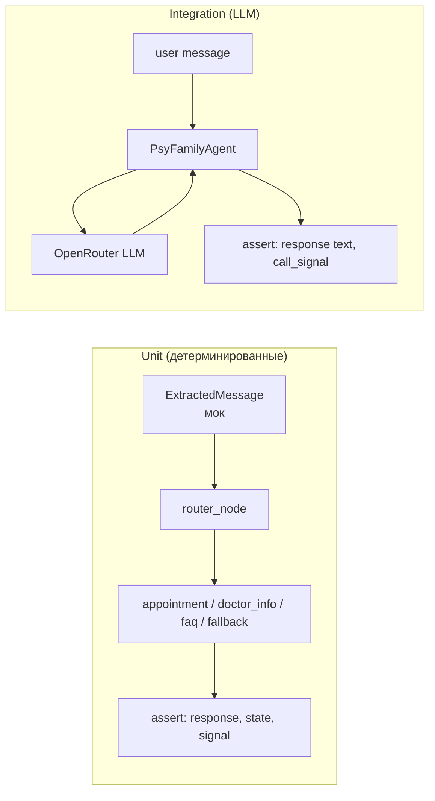

# Автоматическое тестирование AI-агента

Автоматические тесты проверяют диалоговую логику бота на уровне нод, роутинга и полных сценариев. Два уровня: **детерминированные** (без LLM, мгновенные) и **интеграционные** (с реальным LLM, ~3-15 мин).

---

## Архитектура тестов

```
tests/
  conftest.py          # Фикстуры, хелперы: make_state(), extract(), run_turn()
  test_cases.py        # 233 детерминированных теста (cases 1-46 + cross-cutting)
  test_integration.py  # 58 интеграционных тестов (реальный LLM, multi-turn)
```



---

## Уровень 1: Детерминированные тесты

**Файл:** `tests/test_cases.py`

Мокаем LLM-извлечение интентов через объект `ExtractedMessage` и вызываем ноды напрямую. Тесты не зависят от LLM API, выполняются за **< 0.5с**, 100% стабильны.

### Что тестируется

| Класс | Кейс | Проверяет |
|-------|------|-----------|
| `TestCase01` | Запись к врачу по имени | `make_appoint` → предложение слота |
| `TestCase02` | Согласие на слот | `chosen_slot` → запрос имени |
| `TestCase03` | Пациент назвал имя | `patient_name` → запрос даты рождения |
| `TestCase04` | Пациент назвал дату рождения | Подтверждение записи, **без** `end_call` |
| `TestCase05` | Отклонение слота | `slot_not_suitable` → альтернативный слот |
| `TestCase06` | Вопрос о стаже врача | `question_about_doctor` → стаж |
| `TestCase07` | Поиск врача по заболеванию | `want_procedure` → подбор врача |
| `TestCase08` | Вопрос о клинике (FAQ) | `question_about_clinic` → FAQ |
| `TestCase09` | Прощание | `end_conversation` → `end_call` |
| `TestCase10` | Перевод на оператора | `wants_operator` → `transfer_operator` |
| `TestCase11` | Вопрос во время сбора имени | Ответ на вопрос + переспрос имени |
| `TestCase12` | Запись без сбора данных | Нельзя завершить без имени/даты |
| `TestCase13` | Однообразные шаблоны | Слоты предлагаются разными фразами |
| `TestCase14` | «А как тебя зовут?» ≠ имя | Не принимать вопрос за имя пациента |
| `TestCase15` | «А зачем это?» ≠ дата | Не принимать вопрос за дату рождения |
| `TestCase16` | «Информация о враче:» | Нет префикса, естественная подача |
| `TestCase17` | Вопрос о клинике после врача | `question_about_clinic` → FAQ, не перехват |
| `TestCase18` | Контекст врача после FAQ | `pending_doctor_name` сохраняется |
| `TestCase19` | Вопрос о враче при подтверждении слота | Естественный ответ через LLM, без «Информация о враче:» |
| `TestCase44` | Мультиинтент: согласие + вопрос | `chosen_slot` + `question_about_doctor` → оба обрабатываются |
| `TestCase45` | Чередование CTA | «Записать вас на приём?» не повторяется дословно |
| `TestCase46` | «Кто лечит X?» → want_procedure | Поиск врача по заболеванию, не `question_about_clinic` |
| `TestEndCall` | `end_call` только по прощанию | После записи нет `end_call` |
| `TestFAQMatching` | Качество FAQ-матчинга | Правильные совпадения, нет ложных |
| `TestRouterLogic` | Маршрутизация при `pending_action` | Вопросы не блокируются сбором данных |

### Как работает мокинг

```python
from tests.conftest import make_state, extract, run_turn

# Создаём state с замоканным результатом извлечения
state = make_state(
    user_message="Расскажите про его стаж",
    extracted=extract("question_about_doctor", doctor_info="experience"),
    pending_action="ask_patient_name",
    pending_doctor_name="Хайретдинов Олег Замильевич",
)

# Прогоняем через router + соответствующую ноду
state = run_turn(state, doctors_service, medesk_service, faq_service)

# Проверяем результат
assert "стаж" in state["template_response"].lower()
assert state["pending_action"] == "ask_patient_name"  # не сбросился
```

---

## Уровень 2: Интеграционные тесты

**Файл:** `tests/test_integration.py`

Полные multi-turn диалоги через `PsyFamilyAgent` с реальным LLM. Проверяют что LLM правильно извлекает интенты из живых сообщений.

### Требования

- Переменная окружения `LLM_API_KEY` (ключ OpenRouter)
- Доступ к API OpenRouter
- ~3-15 минут на прогон (58 тестов)

### Что тестируется

| Класс | Сценарий | Ключевая проверка |
|-------|----------|-------------------|
| `TestIntegrationCase11` | Вопрос о стаже во время сбора имени | Ответ содержит «стаж»/«лет»/«опыт» |
| `TestIntegrationCase12` | Упоминание заболевания | Нет автоматической записи |
| `TestIntegrationCase14` | «А как тебя зовут?» | Не перешёл к сбору даты рождения |
| `TestIntegrationCase15` | «А зачем это?» | Нет подтверждения записи |
| `TestIntegrationCase16` | Запрос информации о враче | Нет «Информация о враче:» |
| `TestIntegrationCase17` | Вопрос о клинике | Ответ содержит «Psy»/«Family»/«клиника» |
| `TestIntegrationCase18` | Контекст после побочного вопроса | Нет «что вас беспокоит?» |
| `TestIntegrationCase19` | Вопрос о враче при подтверждении слота | Нет «Информация о враче:», естественный ответ |
| `TestIntegrationCase44` | Мультиинтент: «Да, подходит. Расскажите...» | Слот подтверждён + инфо о враче + CTA «Как вас зовут?» |
| `TestIntegrationCase45` | Разнообразие CTA | CTA не повторяются дословно через несколько ответов |
| `TestIntegrationCase46` | «Кто лечит невротическое расстройство?» | Находит Хайретдинова, не даёт generic ответ |
| `TestIntegrationEndCall` | Полный цикл записи + прощание | `end_call` только после «до свидания» |

### Стабильность

Интеграционные тесты могут изредка давать ложные провалы (~5%) из-за вариативности LLM. Рекомендации:

- Проверки формулировать мягко: `assert "стаж" in r.lower() or "опыт" in r.lower()`
- Не проверять точные формулировки, только ключевые слова и сигналы
- При ложном провале — перезапустить один раз перед расследованием

---

## Запуск

```bash
# Активировать виртуальное окружение
source venv/bin/activate

# Только детерминированные (быстрые, без API)
pytest tests/test_cases.py -v

# Только интеграционные (нужен LLM_API_KEY в .env)
set -a && source .env && set +a
pytest tests/test_integration.py -v

# Все тесты
set -a && source .env && set +a && pytest -v

# Только новые кейсы (44, 45, 46)
pytest tests/test_cases.py -k "Case44 or Case45 or Case46" -v
pytest tests/test_integration.py -k "Case44 or Case45 or Case46" -v

# Конкретный кейс
pytest tests/test_cases.py::TestCase11QuestionDuringNameCollection -v
```

---

## CI/CD

### Рекомендуемая конфигурация

| Этап | Тесты | Когда запускать | Время |
|------|-------|-----------------|-------|
| Pre-commit / PR | `test_cases.py` | Каждый push/PR | < 2с |
| Nightly / Pre-release | `test_integration.py` | По расписанию / перед релизом | ~3-15 мин |

### Пример GitHub Actions

```yaml
name: Tests
on: [push, pull_request]

jobs:
  unit-tests:
    runs-on: ubuntu-latest
    steps:
      - uses: actions/checkout@v4
      - uses: actions/setup-python@v5
        with:
          python-version: "3.12"
      - run: pip install -r requirements.txt pytest
      - run: pytest tests/test_cases.py -v

  integration-tests:
    runs-on: ubuntu-latest
    if: github.event_name == 'push' && github.ref == 'refs/heads/main'
    steps:
      - uses: actions/checkout@v4
      - uses: actions/setup-python@v5
        with:
          python-version: "3.12"
      - run: pip install -r requirements.txt pytest
      - run: pytest tests/test_integration.py -v -m integration
        env:
          LLM_API_KEY: ${{ secrets.LLM_API_KEY }}
```

---

## Добавление нового кейса

1. Определить ожидаемое поведение (input → output)
2. Добавить детерминированный тест в `test_cases.py`:

```python
class TestCaseNN:
    def test_описание(self, doctors_service, medesk_service, faq_service):
        state = make_state(
            user_message="Сообщение пациента",
            extracted=extract("intent", ...),
            pending_action=...,
        )
        state = run_turn(state, doctors_service, medesk_service, faq_service)
        resp = collect_response(state)
        assert "ожидаемое" in resp.lower()
```

3. При необходимости — добавить интеграционный тест в `test_integration.py`:

```python
class TestIntegrationCaseNN:
    def test_описание(self, agent):
        sid = "caseNN"
        r1 = chat(agent, "Сообщение пациента", sid)
        assert "ожидаемое" in r1.lower()
        assert signal(agent, sid) is None
```

4. Запустить: `pytest tests/ -v`

---

## Связь с другими документами

- [Архитектура агента](architecture.md) — граф, ноды, потоки данных
- [Ноды графа](nodes.md) — детали логики каждой ноды
- [Сценарии диалога](scenarios.md) — примеры пользовательских сценариев
- [Тестирование (ручное)](../testing_llm.md) — HTTP API, Telegram бот, Docker
