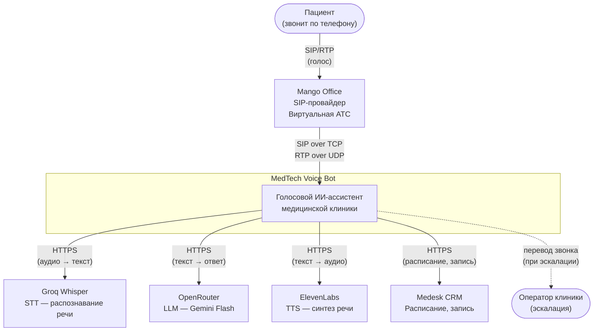

# C1 — System Context Diagram

Верхнеуровневый контекст: кто использует систему и с какими внешними системами она взаимодействует.

## Диаграмма

## Участники

### Пользователи

| Актор | Описание | Взаимодействие |
|-------|----------|----------------|
| **Пациент** | Человек, звонящий в клинику по телефону | Голосовой диалог: задаёт вопросы, записывается к врачу |
| **Оператор клиники** | Живой сотрудник (при эскалации) | Получает переведённый звонок, если бот не справился |

### Внешние системы

| Система | Назначение | Протокол | Направление |
|---------|-----------|----------|-------------|
| **Mango Office** | SIP-провайдер, виртуальная АТС | SIP over TCP, RTP over UDP | Входящие звонки → система |
| **Groq (Whisper)** | Распознавание речи (STT) | HTTPS REST API | Система → Groq (аудио → текст) |
| **OpenRouter (Gemini)** | Генерация ответов, tool calling | HTTPS REST API | Система → OpenRouter (текст → текст) |
| **ElevenLabs** | Синтез речи (TTS) | HTTPS Streaming API | Система → ElevenLabs (текст → аудио) |
| **Medesk** | Медицинская CRM | HTTPS REST API | Система → Medesk (расписание, запись) |

## Ключевые потоки данных

1. **Входящий звонок**: Пациент → Mango → Asterisk → MedBot
2. **Распознавание**: Аудио пациента → Groq Whisper → текст
3. **Генерация ответа**: Текст → OpenRouter/Gemini → ответ (+ tool calls)
4. **Синтез речи**: Текст ответа → ElevenLabs → аудио → пациенту
5. **Действия CRM**: LLM tool call → Medesk API → результат → LLM

## Ограничения и допущения

- Система обрабатывает только **входящие** звонки (исходящие не реализованы)
- Один SIP-транк, один номер (+7 904 953-24-10)
- Все внешние API требуют доступа в интернет
- VPS-хостер блокирует исходящий UDP — SIP работает через TCP
- Medesk CRM пока в режиме stub (mock-данные)
