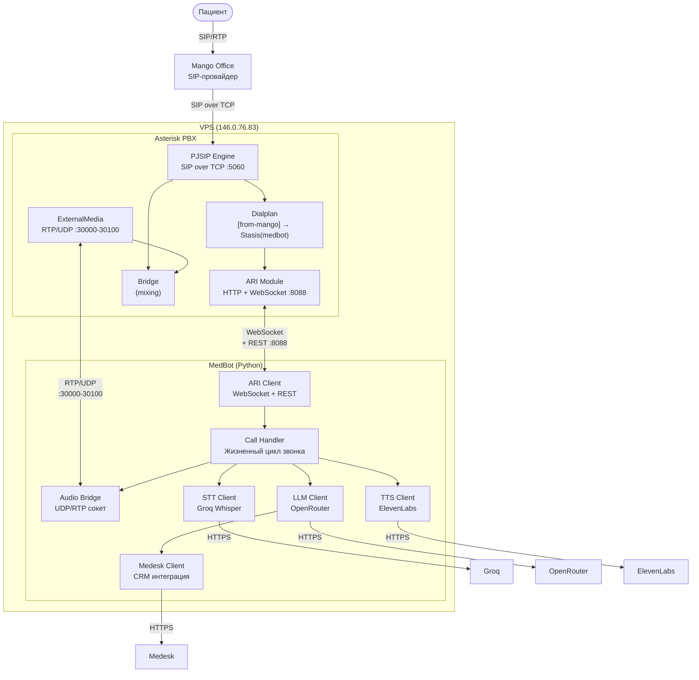

# C2 — Container Diagram

Контейнеры (процессы/приложения), из которых состоит система, и их взаимодействие.

## Диаграмма



## Контейнеры

### Контейнер 1: Asterisk PBX

| Параметр | Значение |
|----------|----------|
| **Технология** | Asterisk 21.12.2 |
| **Процесс** | `/usr/sbin/asterisk` (daemon) |
| **Назначение** | SIP-телефония, маршрутизация, медиа-бриджинг |
| **Порты** | TCP 5060 (SIP), UDP 30000-30100 (RTP), TCP 8088 (ARI HTTP/WS) |

**Внутренние компоненты:**

- **PJSIP Engine** — SIP-стек. Регистрируется на Mango через TCP. Принимает INVITE от Mango, управляет медиа-сессиями.
- **Dialplan** — контекст `[from-mango]`. Направляет все входящие в `Stasis(medbot)` — передаёт управление ARI.
- **ARI Module** (`res_ari` + `app_stasis`) — WebSocket для событий (StasisStart, StasisEnd), REST API для управления каналами, бриджами, медиа.
- **ExternalMedia Channel** — виртуальный канал, связывает RTP-поток с внешним UDP-сокетом бота.
- **Bridge (mixing)** — аудио-мост, соединяет канал пациента с ExternalMedia каналом.

**Ключевые конфиги:**
- `/etc/asterisk/pjsip.conf` — транк с Mango (TCP)
- `/etc/asterisk/extensions.conf` — dialplan
- `/etc/asterisk/ari.conf` — ARI пользователь
- `/etc/asterisk/http.conf` — HTTP-сервер для ARI

### Контейнер 2: MedBot (Python)

| Параметр | Значение |
|----------|----------|
| **Технология** | Python 3.12, asyncio |
| **Процесс** | `python run.py` |
| **Назначение** | ИИ-обработка звонков: STT → LLM → TTS |
| **Точка входа** | `run.py` → класс `MedBot` |

**Внутренние компоненты:**

- **ARI Client** — WebSocket-подключение к Asterisk. Получает события, отправляет REST-команды.
- **Call Handler** — жизненный цикл одного звонка. Оркестрирует: setup → greeting → conversation loop → cleanup.
- **Audio Bridge** — UDP-сокет для приёма/отправки RTP-пакетов. Silence detection на основе энергии сигнала.
- **STT Client** — отправляет аудио в Groq Whisper, получает текст.
- **LLM Client** — управляет диалогом через OpenRouter API. Поддерживает tool calling.
- **TTS Client** — конвертирует текст в ulaw-аудио через ElevenLabs + ffmpeg.
- **Medesk Client** — выполняет tool calls LLM: расписание, запись, информация.

## Взаимодействие между контейнерами

| От | К | Протокол | Описание |
|----|---|----------|----------|
| Asterisk | MedBot | WebSocket (:8088) | ARI события (StasisStart, StasisEnd, Hangup) |
| MedBot | Asterisk | HTTP REST (:8088) | Команды: answer, hangup, create bridge/channel |
| Asterisk | MedBot | RTP/UDP (:30000-30100) | Аудио пациента → бот |
| MedBot | Asterisk | RTP/UDP | Аудио бота → пациент (через ExternalMedia) |

## Сетевая модель

```
Internet ←──TCP 5060──→ Asterisk ←──TCP 8088 (localhost)──→ MedBot
                         ↕                                    ↕
Mango ←───RTP/UDP────→ Bridge ←──RTP/UDP (localhost)──→ AudioBridge
                                                          ↕
                                              HTTPS → Groq, OpenRouter,
                                                      ElevenLabs, Medesk
```

**Важно:** Исходящий UDP на внешние IP заблокирован хостером. SIP-сигнализация с Mango работает только через TCP. RTP от Mango приходит по UDP (инициатор — Mango), ответные RTP-пакеты проходят по тому же UDP-соединению (conntrack).
