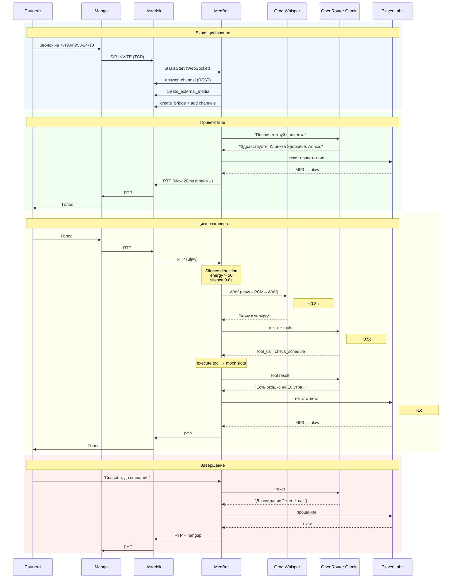

# Sequence Diagram — Обработка звонка

Полная последовательность обработки входящего звонка: от SIP INVITE до завершения.

```mermaid
sequenceDiagram
    participant patient as Пациент
    participant mango as Mango
    participant asterisk as Asterisk
    participant bot as MedBot
    participant stt as Groq Whisper
    participant llm as OpenRouter Gemini
    participant tts as ElevenLabs

    rect rgb(240, 248, 255)
        Note over patient,tts: Входящий звонок
        patient->>mango: Звонок на +7(904)953-24-10
        mango->>asterisk: SIP INVITE (TCP)
        asterisk->>bot: StasisStart (WebSocket)
        bot->>asterisk: answer_channel (REST)
        bot->>asterisk: create_external_media
        bot->>asterisk: create_bridge + add channels
    end

    rect rgb(240, 255, 240)
        Note over patient,tts: Приветствие
        bot->>llm: "Поприветствуй пациента"
        llm-->>bot: "Здравствуйте! Клиника Здоровье, Алиса."
        bot->>tts: текст приветствия
        tts-->>bot: MP3 → ulaw
        bot->>asterisk: RTP (ulaw 20ms фреймы)
        asterisk->>mango: RTP
        mango->>patient: Голос
    end

    rect rgb(255, 255, 240)
        Note over patient,tts: Цикл разговора
        patient->>mango: Голос
        mango->>asterisk: RTP
        asterisk->>bot: RTP (ulaw)
        Note over bot: Silence detection<br/>energy > 50<br/>silence 0.8s
        bot->>stt: WAV (ulaw→PCM→WAV)
        Note right of stt: ~0.3с
        stt-->>bot: "Хочу к хирургу"
        bot->>llm: текст + tools
        Note right of llm: ~0.5с
        llm-->>bot: tool_call: check_schedule
        Note over bot: execute tool → mock slots
        bot->>llm: tool result
        llm-->>bot: "Есть окошко на 10 утра..."
        bot->>tts: текст ответа
        Note right of tts: ~1с
        tts-->>bot: MP3 → ulaw
        bot->>asterisk: RTP
        asterisk->>patient: Голос
    end

    rect rgb(255, 240, 240)
        Note over patient,tts: Завершение
        patient->>bot: "Спасибо, до свидания"
        bot->>llm: текст
        llm-->>bot: "До свидания!" + end_call()
        bot->>tts: прощание
        tts-->>bot: ulaw
        bot->>asterisk: RTP + hangup
        asterisk->>mango: BYE
    end
```
