# C3 — Component Diagram: Core

Детальная архитектура модуля `core/` — ядро обработки звонков.

## Диаграмма

```mermaid
graph TD
    asterisk["Asterisk ARI\n:8088 WebSocket + REST"]

    subgraph core ["core/"]
        subgraph ariclient_box ["ARIClient — ari_client.py"]
            ws["connect() — WebSocket"]
            rest["REST: answer, hangup,\ncreate_bridge, add_to_bridge,\ncreate_external_media"]
        end

        subgraph medbot_box ["MedBot — run.py"]
            start["_on_stasis_start()"]
            end_ev["_on_stasis_end()"]
            port["_allocate_port()\nround-robin 30000-30100"]
        end

        subgraph handler_box ["CallHandler — call_handler.py"]
            setup["_setup()\nanswer → ext_media → bridge"]
            greeting["_greeting()\nwait RTP → LLM → TTS"]
            loop["_conversation_loop()\nlisten → STT → LLM → TTS"]
            vad["_listen_for_speech()\nVAD: energy > 50, silence 0.8s"]
            speak["_speak()\nTTS → send_audio"]
            cleanup["_cleanup()\nclose all resources"]
        end

        subgraph audio_box ["AudioBridge — audio_bridge.py"]
            bind["start() — bind UDP"]
            recv["receive_audio() — RTP → ulaw"]
            send["send_audio() — ulaw → RTP 20ms"]
        end

        subgraph rtp_box ["RTP Layer — rtp.py"]
            packet["RTPPacket\nparse() / build()"]
            sender["RTPSender\nseq++ / ts += 160"]
        end
    end

    asterisk <-->|"WebSocket\n+ REST"| ariclient_box
    ariclient_box -->|callbacks| medbot_box
    medbot_box -->|"создаёт\nпо звонку"| handler_box
    handler_box -->|"приём/отправка\nаудио"| audio_box
    audio_box -->|"parse/build\nRTP пакетов"| rtp_box
```



## Компоненты

### ARIClient (`core/ari_client.py`)

**Назначение:** Единственная точка связи с Asterisk. Инкапсулирует WebSocket-подключение для событий и REST API для команд.

**Ответственность:**
- Подключение к WebSocket (`/ari/events?app=medbot`)
- Автоматический реконнект при обрыве (интервал 5 сек)
- Маршрутизация событий через callbacks: `on_stasis_start`, `on_stasis_end`, `on_channel_hangup`
- REST-обёртки для всех необходимых ARI операций

**Детали реализации:**
- Использует `aiohttp` для WebSocket и HTTP
- BasicAuth аутентификация
- Каждый REST-запрос логирует ошибки (status >= 400)
- Обработчики событий вызываются через `asyncio.create_task()` — не блокируют event loop

### MedBot (`run.py`)

**Назначение:** Точка входа. Управляет пулом активных звонков и распределением RTP-портов.

**Ответственность:**
- Создание `ARIClient` и подключение к Asterisk
- Обработка `StasisStart` — создание `CallHandler` для каждого нового звонка
- Фильтрация ExternalMedia каналов (они тоже генерируют StasisStart)
- Обработка `StasisEnd` / `ChannelHangupRequest` — остановка handler'а
- Round-robin аллокация RTP-портов (30000-30100)

**Детали реализации:**
- `_active_calls: dict[str, CallHandler]` — реестр активных звонков по channel_id
- ExternalMedia каналы фильтруются по имени (`UnicastRTP/...`)
- Каждый звонок обрабатывается в отдельной asyncio task

### CallHandler (`core/call_handler.py`)

**Назначение:** Жизненный цикл одного звонка. Оркестрирует весь пайплайн STT → LLM → TTS.

**Ответственность:**
- Setup: ответ на звонок, создание ExternalMedia, бридж
- Greeting: запрос приветствия у LLM, озвучивание через TTS
- Conversation loop: слушаем → распознаём → генерируем → озвучиваем
- Silence detection: определение начала/конца речи по энергии сигнала
- Cleanup: освобождение всех ресурсов Asterisk

**Silence Detection (VAD):**
```
Энергия = среднее отклонение байтов от ulaw-тишины (0xFF/0x7F)

if энергия > 50:     → речь
if энергия <= 50:    → тишина
if тишина > 0.8с:    → конец фразы, отправляем в STT
if речь < 0.2с:      → шум, игнорируем
```

### AudioBridge (`core/audio_bridge.py`)

**Назначение:** Управление UDP-сокетом для двунаправленного RTP аудио.

**Ответственность:**
- Bind UDP на выделенный порт (localhost)
- Приём RTP-пакетов: парсинг через `RTPPacket.parse()`, извлечение payload
- Автоопределение адреса Asterisk при первом полученном пакете (`_remote_addr`)
- Отправка ulaw-аудио: нарезка на 160-байтовые фреймы (20ms), отправка с pacing 20ms

**Детали реализации:**
- Используется `asyncio_dgram` для асинхронного UDP
- Таймаут приёма: 1 секунда
- Padding последнего фрейма тишиной (0xFF) при неполном размере

### RTP Layer (`core/rtp.py`)

**Назначение:** Низкоуровневая работа с RTP-пакетами.

**RTPPacket:**
- `parse()` — разбирает бинарный RTP-пакет: версия, payload type, sequence, timestamp, SSRC, CSRC, extension header, payload
- `build()` — собирает пакет: 12-байтовый заголовок + payload

**RTPSender:**
- Поддерживает sequence number (инкремент на 1) и timestamp (инкремент на размер payload)
- Фиксированные SSRC и payload_type

## Потоки данных

### Входящий звонок (setup)

```
Mango ──INVITE──→ Asterisk ──StasisStart──→ MedBot
                                              │
                                    CallHandler.run()
                                              │
                              ┌───────────────┼───────────────┐
                              ▼               ▼               ▼
                         answer()     create_external_   create_bridge()
                                      media(:30000)         │
                                              │         add_to_bridge
                                              │         (patient + ext)
                                              ▼
                                    AudioBridge.start()
                                    bind UDP :30000
```

### Цикл разговора

```
                     Пациент говорит
                           │
                    RTP/UDP пакеты
                           │
              ┌────────────▼────────────┐
              │  AudioBridge.receive()   │
              │  → RTPPacket.parse()    │
              │  → ulaw payload         │
              └────────────┬────────────┘
                           │
              ┌────────────▼────────────┐
              │  Silence Detection      │
              │  (энергия > 50?)        │
              │  Накапливаем буфер      │
              │  Ждём 0.8с тишины       │
              └────────────┬────────────┘
                           │ bytes
              ┌────────────▼────────────┐
              │  STT (Groq Whisper)     │
              │  ulaw → PCM → WAV      │
              │  → HTTP POST            │
              │  → текст                │
              └────────────┬────────────┘
                           │ text
              ┌────────────▼────────────┐
              │  LLM (OpenRouter)       │
              │  messages[] + tools     │
              │  → response + tool_calls│
              │  → execute tools        │
              │  → final text           │
              └────────────┬────────────┘
                           │ text
              ┌────────────▼────────────┐
              │  TTS (ElevenLabs)       │
              │  text → MP3 stream      │
              │  → ffmpeg → ulaw 8kHz  │
              └────────────┬────────────┘
                           │ ulaw bytes
              ┌────────────▼────────────┐
              │  AudioBridge.send()     │
              │  → 160-byte frames      │
              │  → RTPSender.make()     │
              │  → UDP send (20ms pace) │
              └────────────┬────────────┘
                           │
                    RTP/UDP пакеты
                           │
                    Пациент слышит
```
