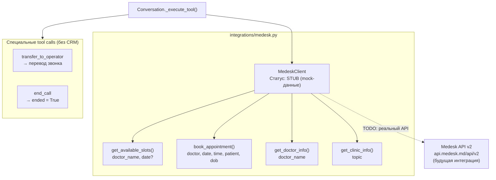

# C3 — Component Diagram: Integrations Module

Детальная архитектура модуля `integrations/` — интеграция с медицинской CRM.

## Диаграмма



## Компонент: MedeskClient (`integrations/medesk.py`)

**Назначение:** Интерфейс к медицинской CRM Medesk. Предоставляет данные о расписании врачей и управляет записью пациентов.

**Текущий статус:** Stub-реализация с mock-данными для разработки и тестирования.

### Методы

| Метод | Параметры | Возвращает | Описание |
|-------|-----------|-----------|----------|
| `get_available_slots` | `doctor_name`, `date?` | Список слотов | Свободные окна врача |
| `book_appointment` | `doctor_name`, `date`, `time`, `patient_name`, `patient_dob` | Подтверждение | Запись пациента |
| `get_doctor_info` | `doctor_name` | Профиль врача | Специализация, стаж, расписание |
| `get_clinic_info` | `topic` | Информация | Адрес, часы, услуги |

### Mock-данные

**get_available_slots:**
```json
{
  "doctor": "Иванов",
  "date": "2026-04-04",
  "slots": [
    {"time": "10:00", "available": true},
    {"time": "11:30", "available": true},
    {"time": "14:00", "available": true},
    {"time": "16:30", "available": true}
  ]
}
```

**book_appointment:**
```json
{
  "status": "booked",
  "doctor": "Иванов",
  "date": "2026-04-04",
  "time": "10:00",
  "patient": "Петрова Мария Ивановна",
  "cost": "3000 рублей",
  "message": "Запись подтверждена. Уведомление отправлено на телефон."
}
```

**get_doctor_info:**
```json
{
  "name": "Иванов",
  "specialty": "Терапевт",
  "experience": "10 лет",
  "schedule": "Пн-Пт 9:00-18:00",
  "description": "Опытный специалист с высшей категорией."
}
```

**get_clinic_info:**
```json
{
  "name": "МедТех Клиника",
  "address": "г. Москва, ул. Примерная, д. 1",
  "hours": "Пн-Пт 8:00-20:00, Сб 9:00-15:00",
  "phone": "+7 (904) 953-24-10",
  "services": "Терапия, неврология, кардиология, ЭПИ, УЗИ, МРТ"
}
```

### План интеграции с реальным Medesk API

Medesk API v2: `https://api.medesk.md/api/v2`

**Необходимые endpoints:**

| Действие | Medesk API endpoint | Метод |
|----------|---------------------|-------|
| Список врачей | `/doctors` | GET |
| Расписание врача | `/doctors/{id}/schedule` | GET |
| Свободные слоты | `/doctors/{id}/available_slots?date=...` | GET |
| Создание записи | `/appointments` | POST |
| Информация о клинике | `/clinics/{id}` | GET |

**Что нужно для подключения:**
1. Получить API-ключ Medesk
2. Заполнить `MEDESK_API_KEY` в `.env`
3. Заменить mock-методы на реальные HTTP-запросы
4. Маппинг `doctor_name` → `doctor_id` (поиск по имени/фамилии)
5. Обработка ошибок API и fallback на mock при недоступности

### Специальные tool calls (без CRM)

Два tool call обрабатываются в `Conversation`, не в MedeskClient:

| Tool | Обработка | Эффект |
|------|-----------|--------|
| `transfer_to_operator` | Возврат `{"status": "transfer_initiated"}` | TODO: реальный перевод через Asterisk |
| `end_call` | Установка `self._ended = True` | CallHandler завершает цикл и кладёт трубку |
