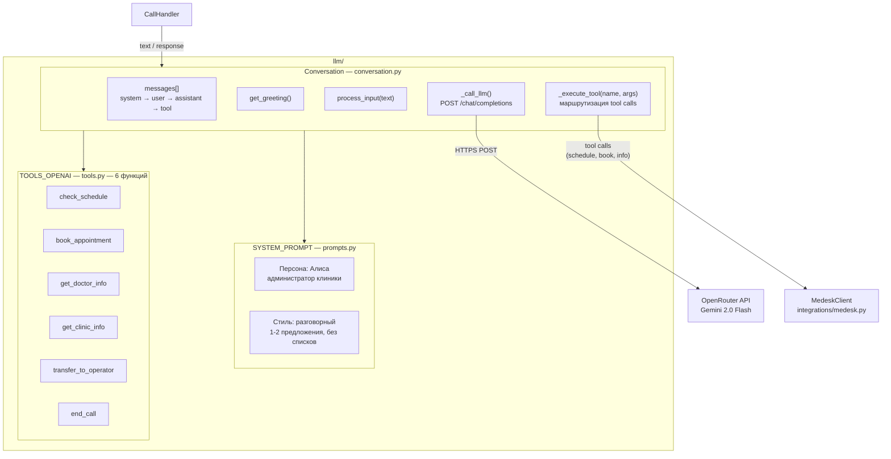

# C3 — Component Diagram: LLM Module

Детальная архитектура модуля `llm/` — управление диалогом и tool calling.

## Диаграмма



## Компоненты

### Conversation (`llm/conversation.py`)

**Назначение:** Управление диалогом с LLM. Хранит историю сообщений, обрабатывает tool calls.

**Состояние:**
- `messages: list[dict]` — полная история диалога (system + user + assistant + tool)
- `ended: bool` — флаг завершения разговора (устанавливается tool `end_call`)
- `model: str` — модель LLM (настраивается через `.env`)

**Методы:**

| Метод | Описание |
|-------|----------|
| `get_greeting()` | Запрашивает у LLM приветствие. Отправляет специальный user-промпт `[Пациент позвонил в клинику. Поприветствуй.]` |
| `process_input(text)` | Добавляет реплику пациента в историю, вызывает LLM |
| `_call_llm()` | POST в OpenRouter API. Обрабатывает ответ: если есть `tool_calls` — выполняет и вызывает себя рекурсивно |
| `_execute_tool(name, args)` | Маршрутизирует tool call к MedeskClient или внутренним функциям |

**Tool Calling Flow:**

```
1. User: "Запишите меня к хирургу на завтра"
   │
2. LLM → tool_call: check_schedule(doctor_name="хирург", date="2026-04-04")
   │
3. _execute_tool() → MedeskClient.get_available_slots()
   │                  → {"slots": [{"time": "10:00"}, {"time": "14:00"}]}
   │
4. Результат добавляется в messages как role=tool
   │
5. _call_llm() вызывается повторно с результатом
   │
6. LLM → "У хирурга свободны слоты на 10:00 и 14:00. Какое время вам подходит?"
```

**Параметры запроса к OpenRouter:**

| Параметр | Значение | Обоснование |
|----------|----------|-------------|
| `max_tokens` | 300 | Короткие ответы для телефонного разговора |
| `temperature` | 0.7 | Баланс между естественностью и предсказуемостью |
| `tools` | TOOLS_OPENAI | 6 функций для CRM-интеграции |

### System Prompt (`llm/prompts.py`)

**Назначение:** Определяет личность и поведение бота.

**Персона:** Алиса — голосовой администратор медицинской клиники.

**Ключевые правила:**
- 1-3 предложения за раз (телефонный формат)
- Естественная речь, без списков и форматирования
- Не представляется ботом
- Главная цель — привести к записи на приём
- Не ставит диагнозов, не назначает лечение
- Эскалация на оператора по запросу

**5 сценариев:**
1. Запись к конкретному врачу
2. Описание проблемы → подбор врача
3. Вопрос о враче
4. Вопрос о клинике
5. Произвольный вопрос

### Tools (`llm/tools.py`)

**Назначение:** JSON-схемы функций в формате OpenAI function calling.

| Tool | Параметры | Описание |
|------|-----------|----------|
| `check_schedule` | `doctor_name`, `date?` | Проверить свободные слоты |
| `book_appointment` | `doctor_name`, `date`, `time`, `patient_name`, `patient_dob` | Записать пациента |
| `get_doctor_info` | `doctor_name` | Информация о враче |
| `get_clinic_info` | `topic` | Информация о клинике |
| `transfer_to_operator` | — | Перевод на оператора |
| `end_call` | — | Завершение разговора |

## Модель данных (messages)

```json
[
  {"role": "system", "content": "Ты — Алиса, голосовой ассистент..."},
  {"role": "user", "content": "[Пациент позвонил в клинику. Поприветствуй.]"},
  {"role": "assistant", "content": "Здравствуйте! Клиника «Здоровье»..."},
  {"role": "user", "content": "Хочу записаться к хирургу"},
  {"role": "assistant", "content": null, "tool_calls": [
    {"id": "call_1", "function": {"name": "check_schedule", "arguments": "{\"doctor_name\": \"хирург\"}"}}
  ]},
  {"role": "tool", "tool_call_id": "call_1", "content": "{\"slots\": [...]}"},
  {"role": "assistant", "content": "У хирурга свободны слоты на 10:00 и 14:00..."}
]
```

## Обработка ошибок

- HTTP ошибка от OpenRouter → возвращается fallback: "Извините, произошла ошибка. Попробуйте позже."
- Tool call с неизвестным именем → `{"error": "Unknown tool: ..."}`
- Пустой ответ LLM → `process_input()` возвращает пустую строку, CallHandler пропускает TTS
