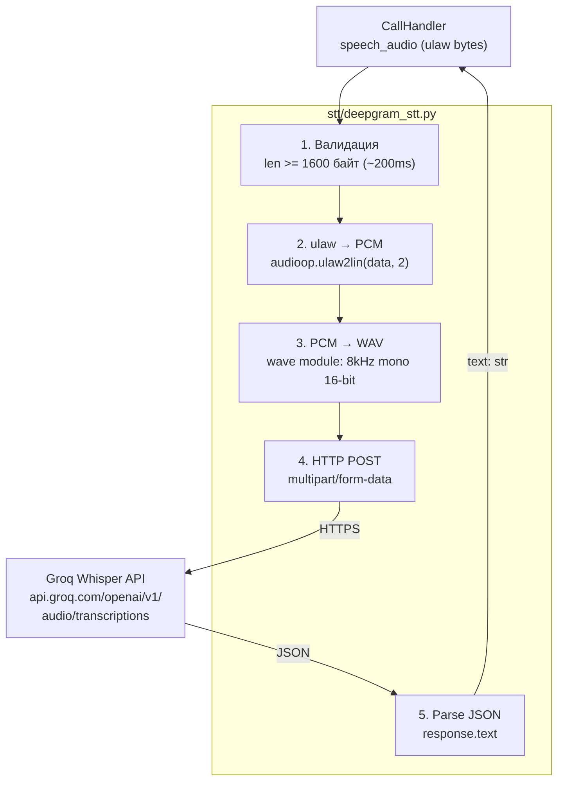

# C3 — Component Diagram: STT Module

Детальная архитектура модуля `stt/` — распознавание речи.

## Диаграмма

## Компонент: transcribe_ulaw()

**Файл:** `stt/deepgram_stt.py`

**Назначение:** Преобразование ulaw-аудио из RTP-потока в текст через Whisper API.

### Конвейер обработки

| Шаг | Операция | Формат входа | Формат выхода |
|-----|----------|-------------|---------------|
| 1 | Валидация длины | ulaw bytes | — |
| 2 | ulaw → PCM | ulaw 8kHz 8-bit | PCM 8kHz 16-bit signed LE |
| 3 | PCM → WAV | raw PCM | WAV container |
| 4 | HTTP POST | WAV file | JSON response |
| 5 | Parse response | JSON | text string |

### Параметры

| Параметр | Значение | Описание |
|----------|----------|----------|
| `api_url` | `https://api.groq.com/openai/v1/audio/transcriptions` | Groq Whisper endpoint |
| `model` | `whisper-large-v3` | Лучшая модель для русского |
| `language` | `ru` | Подсказка языка (ускоряет распознавание) |
| `response_format` | `json` | Формат ответа |
| `timeout` | 30 сек | HTTP таймаут |
| Min audio length | 1600 байт (~200ms) | Минимум для осмысленного распознавания |

### Выбор провайдера: Groq Whisper

| Критерий | Groq | OpenAI | Deepgram |
|----------|------|--------|----------|
| Стоимость | Бесплатно | $0.006/мин | $0.0043/мин |
| Скорость | ~0.3-0.5с | ~1-2с | ~0.3с |
| Качество (русский) | Отличное | Отличное | Хорошее |
| API совместимость | OpenAI-compatible | — | Свой формат |

Groq выбран за: бесплатность, скорость, отличное качество распознавания русского, OpenAI-совместимый API.

### Обработка ошибок

- Аудио < 200ms → пустая строка (не отправляем)
- HTTP ошибка → лог + пустая строка
- Exception → лог + пустая строка
- Пустой текст в ответе → пустая строка

### Замечание по наименованию

Файл называется `deepgram_stt.py` по историческим причинам — изначально планировался Deepgram, но был заменён на Groq Whisper. API-совместимость позволяет переключиться на любой Whisper-совместимый endpoint сменой URL и ключа.
