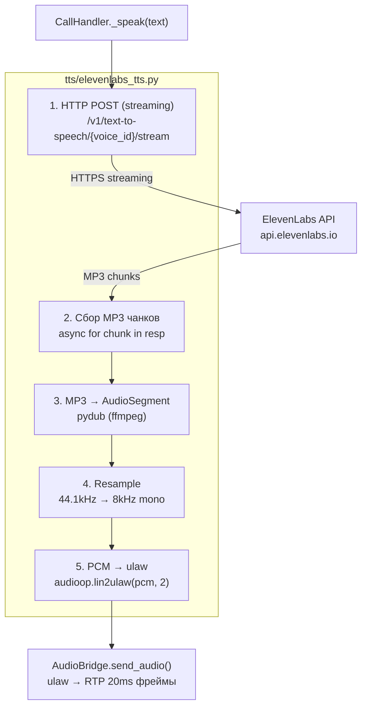

# C3 — Component Diagram: TTS Module

Детальная архитектура модуля `tts/` — синтез речи.

## Диаграмма



## Компонент: synthesize()

**Файл:** `tts/elevenlabs_tts.py`

**Назначение:** Преобразование текста в ulaw-аудио для воспроизведения через RTP.

### Конвейер обработки

| Шаг | Операция | Формат | Инструмент |
|-----|----------|--------|------------|
| 1 | HTTP POST (streaming) | text → MP3 stream | httpx |
| 2 | Сбор чанков | MP3 chunks → MP3 bytes | — |
| 3 | MP3 → AudioSegment | MP3 → internal | pydub (ffmpeg) |
| 4 | Resample + mono | 44.1kHz stereo → 8kHz mono | pydub |
| 5 | PCM → ulaw | PCM 16-bit → ulaw 8-bit | audioop |

### Параметры

| Параметр | Значение | Описание |
|----------|----------|----------|
| `model_id` | `eleven_flash_v2_5` | Быстрая модель с низкой задержкой |
| `optimize_streaming_latency` | `3` | Максимальная оптимизация задержки (0-4) |
| `stability` | `0.5` | Стабильность голоса (0 = вариативный, 1 = стабильный) |
| `similarity_boost` | `0.75` | Схожесть с оригиналом голоса |
| `timeout` | 30 сек | HTTP таймаут |

### Выбор модели

| Модель | Задержка | Качество | Языки |
|--------|---------|----------|-------|
| `eleven_multilingual_v2` | ~1.5-2с | Высокое | 29 языков |
| `eleven_flash_v2_5` | ~0.5-1с | Хорошее | 32 языка |
| `eleven_turbo_v2_5` | ~0.3-0.5с | Среднее | English only |

**Выбрана `eleven_flash_v2_5`** — лучший баланс скорости и качества для русского языка.

### Почему MP3 → ulaw, а не ulaw напрямую?

ElevenLabs streaming endpoint (`/stream`) возвращает **MP3** независимо от запрошенного `output_format`. Формат `ulaw_8000` работает только на non-streaming endpoint, который не подходит для real-time (ожидание полного синтеза).

Конвертация MP3 → ulaw через pydub+ffmpeg добавляет ~10-20ms — пренебрежимо мало.

### Конвертер: _mp3_to_ulaw()

```python
def _mp3_to_ulaw(mp3_data: bytes) -> bytes:
    audio = AudioSegment.from_mp3(io.BytesIO(mp3_data))
    audio = audio.set_frame_rate(8000).set_channels(1).set_sample_width(2)
    pcm = audio.raw_data
    return audioop.lin2ulaw(pcm, 2)
```

**Зависимости:**
- `pydub` — Python-обёртка над ffmpeg
- `ffmpeg` — системная утилита для декодирования MP3
- `audioop` — встроенный модуль Python для аудио-конвертаций

### Обработка ошибок

- HTTP ошибка от ElevenLabs → лог + пустые bytes
- Пустой ответ → пустые bytes
- Ошибка конвертации → exception пробрасывается в CallHandler
